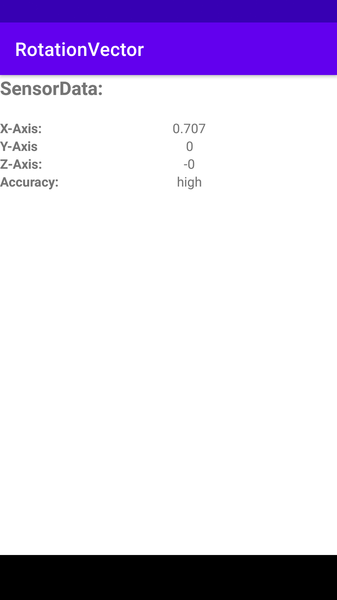

# Rotation Vector

Created a program, that shows the VectorRotation of the x, y and z axis.
There is also a feature with `onPause()` and `onResume()`, that stops the program in case someone is trying to call you.

### Demo

